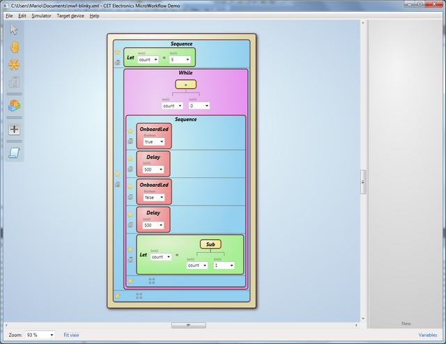

## Description
Create your own automation on Netduino in a visual way.

**Disclaimer:** _this project and its name has nothing to do with the_ [http://micro-workflow.com/](http://micro-workflow.com/) _site._

Cet MicroWorkflow is a framework layer for creating simple automation on the top of a host .Net application. It currently supports both the standard .Net framework, and the .Net MF.

It’s not meant as a replacement of the underlying programming language, but rather a simple and effective way for creating small tasks, which aid the main hosting application. A dedicate engine provide one or more tasks to run, by interpreting runtime the complied workflow designed by the user.
The language structure is procedural, similar to Pascal. Several functions are available at the moment of writing, but many more will be added, as well as general improvements.

## At a glance…

Structural features:

* Deeply inspired by the [Windows Workflow Foundation](http://msdn.microsoft.com/en-us/library/dd489441.aspx): meant to be a very light, yet flexible platform for small/embedded devices.
* The tasks run on the top of the .Net framework, so that their implementation code can be loaded/unloaded anytime, with absolutely no assembly-gluing.
* No special firmwares are required.
* The tasks run in a “sandbox”, which share a custom interface with the hosting application. This is perfect for keeping the application protected, while the custom tasks can be modified by the user.
* The engine is structured in a functional-fashion: that yields to an easier thread-safe concurrency, for running many tasks simultaneously.
* A compiled task is very compact and easy to transfer, as a simple string is.
* Total independence from the communication channel: the data can be sent via TCP/IP, UART, SPI, etc. Any feasible way for exchanging a string can be used.
* The compiled tasks may be stored in any non-volatile medium, such as SD or EEProm. Afterward, the hosting app could load the right task on-demand.

Interop features:

* No skilled programming required, nor complicated IDEs. Even Visual Studio is not required. A full-visual approach has been chosen for creating your own tasks.
* The target engine supports the step-by-step remote-debugging of the running tasks (i.e. over the same channel above mentioned). _(COMING SOON)_
* Ability to create your own procedures and functions by using the workflow. _(COMING SOON)_
* Block commenting. _(COMING SOON)_
* Performance (see [here](http://highfieldtales.wordpress.com/2012/09/29/introducing-microworkflow-for-netduino/))

Known limitations:

* no support for exception yet. _(COMING SOON)_
* no support for arrays yet.
* no support for even trivial literal expressions (e.g. “3+5″), and blocks must be used instead. However, this feature is planned.
* not feasible for specialized/low-level tasks, such as buffers, port handshakings, etc. These features should be exposed by the hosting app interface.
* no overload resolution for generic functions/procedures. However, operators are overloaded.

## The hardware prototype used

Notes:
* the orange wire from Aref to +3.3V is required only for Netduinoes rev. A
* the buttons are shorting to the ground, so that "pressed" yields a "zero"
* the resistor in series to each button needs to protect the port in case of wrong direction (i.e. an output instead of an input)
* the trimpot is used to generate a variable voltage to the analog input: it can be any value from 1k to 100k (suggested 10k)

Sponsored by:

